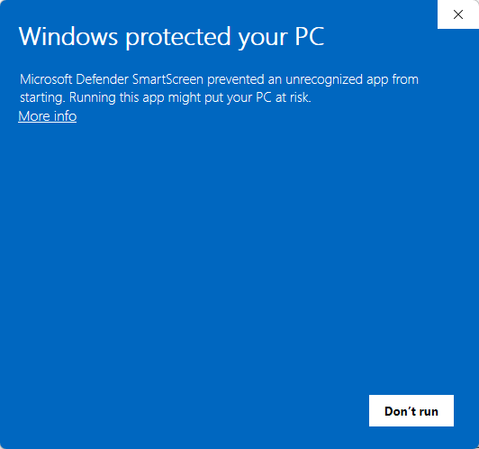

# Installing the openEQUELLA Bulk Uploader

This guide is for the person who will actually run the program — not for a
developer. It assumes you have never used a command line and don't need to
start now. If a step doesn't work the way this guide describes, skip ahead to
[If something goes wrong](#if-something-goes-wrong).

## What you need before you start

Two things, and you cannot get either one from this program:

1. **The program itself**, copied from the network share (see below).
2. **A client ID, a client secret, and a redirect URL**, given to you
   separately by your administrator — usually by email or in person, never as
   part of the download. These are what let the program sign in to
   openEQUELLA as you. Without them, the program opens fine but cannot do
   anything.

If you don't have the client ID, secret, and redirect URL yet, ask your
administrator before going any further. There's nothing to configure in the
program until you have them.

## Step 1: Copy the program from the network share

Your administrator will tell you where the network share is. Copy the whole
folder to somewhere on your own computer — your Desktop or Documents folder
is fine. Do not run it directly from the network share; copy it locally
first, then run it from there.

Two versions of the program may be provided:

- **`openEQUELLA Bulk Uploader 0.1.0.exe`** — a single file. Just double-click
  it to run; nothing is installed. This is the simplest option if you're not
  sure which one to use.
- **`openEQUELLA Bulk Uploader Setup 0.1.0.exe`** — an installer. Double-click
  it, follow the prompts, and it adds a shortcut to your Start Menu like a
  normal Windows program. Use this one if you want it to show up in your
  Start Menu and you're comfortable clicking through an installer.

Either one works the same way once it's running. If you're not sure, use the
single-file version.

If you use the installer, one screen asks **who** to install it for. Leave
the default option selected — it installs just for you and needs no special
permissions. If a Windows prompt appears asking for an administrator's
permission, you've picked the "install for all users" option by mistake:
go back and choose the default (per-user) option instead, or close the
installer and use the single-file version above, which never asks this
question at all.

## Step 2: The security warning (this is expected)

The first time you run the program, Windows will almost certainly show a blue
or gray screen titled **"Windows protected your PC"**, with the program name
underneath. This is normal — it is **not** a sign that something is wrong or
dangerous.

Here's why it appears: this program isn't yet digitally signed with a
certificate that Windows recognizes. That's a paperwork/cost step, not a
safety one — Windows shows this warning for *any* unsigned program, no matter
how safe it is, the first time it's run on a computer.

<!--
  PENDING: real screenshot of the SmartScreen "Windows protected your PC"
  dialog, to be captured by the operator during the clean-machine test
  (docs/superpowers/plans/2026-08-04-desktop-gui.md, Task 10 Step 3). Replace
  this placeholder with the actual image once captured -- do not remove the
  slot, the plan and spec both require a screenshot here.
-->

To continue past it:

1. Click **More info** (a small link, usually below the message).
2. A new button appears: click **Run anyway**.

That's it — the program opens normally. Windows won't ask again on that
computer once you've done this once for this program.

If you don't see a **More info** link, or the button is missing entirely, ask
your administrator — occasionally IT policy on a given computer blocks it
outright rather than just warning about it.

## Step 3: First run — entering your credentials

The first time the program opens, it shows a **Set up the Bulk Uploader**
screen. This is where you enter the client ID, client secret, and redirect
URL your administrator gave you (see [What you need before you start](#what-you-need-before-you-start)
if you don't have them yet).

A few things worth knowing about this screen:

- **These three values are specific to you and to one openEQUELLA instance**
  (Production or Test). Most people only ever need Production — leave that
  selected unless your administrator specifically told you to use Test.
- **Type or paste them exactly.** The redirect URL in particular has to match
  what your administrator registered character-for-character, including
  whether or not it ends with a slash (`/`). If sign-in fails later with an
  error mentioning `redirect_uri`, this is the first thing to check.
- Once saved, these are stored **encrypted, for your Windows user account
  only**, using the same protection Windows uses for saved passwords. Nobody
  else who logs into this computer can read them, and they never leave this
  machine except to sign in to openEQUELLA itself.
- The program is never shipped with these values already filled in. If you
  see them pre-filled, or if a colleague's copy of the program already has
  your name signed in, something is wrong — stop and ask your administrator.

## Step 4: Signing in

After Setup, click **Sign in**. A window opens showing the normal openEQUELLA
/ university sign-in page — sign in there exactly as you would in a web
browser. When it's done, the window closes by itself and the program shows
**"Signed in as `<your name>`."**

That name matters: it's who will own every item the program creates during
this session. If it shows the wrong name, sign out and sign in again as
yourself before doing any uploads.

## Try it first: the built-in starter kit

Before you build your own spreadsheet, it's worth doing one real test upload
using the starter kit built into the program — it takes a minute and proves
your sign-in, collection, and spreadsheet all work together before you risk
any real data on it.

Once you're signed in, on the **Choose what to upload** screen there's a
button next to the spreadsheet picker: **Save a template and sample file…**.
Click it and pick any folder — your Desktop is fine. The program saves two
files there:

- **`upload-template.csv`** — a spreadsheet with the real column headers the
  program expects (the ones your administrator's schema actually uses, not
  guesses), already filled in with one example row.
- **`sample-upload.txt`** — a small text file that example row uploads as its
  attachment.

The example row's title is deliberately **`TEST UPLOAD - safe to delete`** —
so if you go through with it, the item it creates in openEQUELLA is
unmistakable and easy to find again afterward.

To run the test upload:

1. Set the **files folder** (step 3 on the Choose screen) to the folder you
   just saved the two files into.
2. Set the **spreadsheet** (step 2) to `upload-template.csv` in that same
   folder.
3. Pick any collection you have access to, then continue through Review and
   Confirm as you normally would.

This creates one real **draft** item in openEQUELLA — go find and delete it
there once you've confirmed the upload worked. Nothing about running this
test is different from a real batch; it's the same code path, just with a
spreadsheet and file the program already knows are correct.

## What happens when you upload

This guide covers installing and starting the program, not the full upload
process — the program itself walks you through choosing a spreadsheet, a
folder of files, and reviewing everything before anything is sent. The one
thing worth knowing in advance:

**Items are created as drafts by default**, and this is deliberate. A draft
is created in openEQUELLA but is not visible to anyone until it is reviewed
and submitted *inside openEQUELLA itself* — the program does not do that part
for you. After a batch finishes, someone still needs to go into openEQUELLA
and submit the new drafts. Nothing goes live automatically.

(The program also offers a "Published" option that skips the draft step and
makes items visible immediately. It's guarded by an extra confirmation
because there is no way to undo it from the program — if you weren't told to
use it, don't.)

## If something goes wrong

- **The SmartScreen warning won't let you past "More info."** Ask your
  administrator — this can mean local IT policy is blocking unsigned
  programs on that specific computer.
- **Sign-in fails, or the program reports an error page from openEQUELLA
  itself.** Double- and triple-check the redirect URL you entered in Setup
  against what your administrator gave you — this is by far the most common
  cause, and it has to match exactly, including a trailing slash if there is
  one.
- **The program says no credentials are saved**, even though you entered
  them. Credentials are saved separately for Production and Test — make sure
  you're on the instance (shown at the top of every screen) you actually
  configured.
- **A row failed during upload.** The Results screen at the end lists exactly
  which rows failed and why, and has a **Retry failed** button. This does not
  retry the whole batch — only the rows that failed.
- **Nothing above covers it, or you're not sure what happened.** Contact your
  administrator with a screenshot of whatever error message you see. Don't
  guess and don't retry an upload you're unsure about — ask first, especially
  if it says something was left "interrupted."
